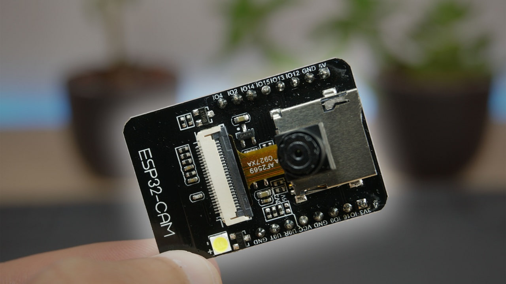
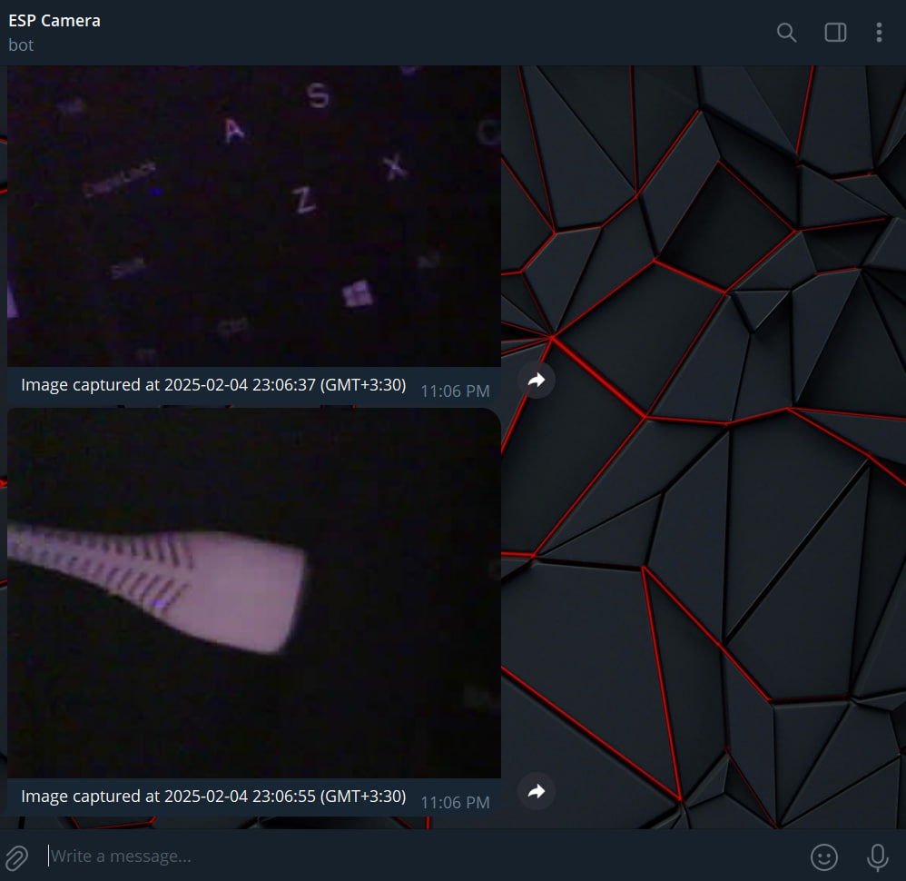

# 📷 ESP32-CAM Live Stream & Telegram Photo Uploader

  <div align="center">
    
  </div>

A project that enables **ESP32-CAM** to stream live video and send captured images to a **Telegram bot** via a **Flask-based VPS server** using 8b/10b & 64b/66b Encoding. 🚀

## 🎯 Features
- 📡 **Live video streaming** from ESP32-CAM over WiFi.
- 🖼️ **Capture and send images** to a VPS server.
- 🔐 **Blocking 8b/10b & 64b/66b encoding** for reliable data transmission.
- 🤖 **Automatic Telegram bot integration** for instant image notifications.
- 🔗 **Flask server** to receive images and forward them to Telegram.

  <div align="center">
    
  </div>

---

## 🛠️ Hardware & Software Requirements

### 📌 Hardware:
- **ESP32-CAM** with OV2640 camera.
- Power supply (5V micro USB or battery).
- Stable WiFi connection.

### 📌 Software:
- **Arduino IDE** with ESP32 board support.
- **Python 3** with Flask installed on the VPS.
- A **Telegram bot** for receiving images.

---

## 🔹 Explanation of 8b/10b & 64b/66b Encoding:

### ✅ **8b/10b Encoding**:
- A method used in high-speed serial communication (like PCIe, USB, and HDMI).
- Converts 8-bit data into a 10-bit code to maintain **DC balance** and **reduce transmission errors**.
- Adds extra **control bits** to prevent long sequences of `0s` or `1s`, ensuring stable transmission.

### ✅ **64b/66b Encoding**:
- More **efficient** than 8b/10b, used in **10Gb Ethernet**.
- Converts 64-bit data into a **66-bit frame**.
- Uses only **2 extra bits per block**, reducing overhead and improving speed.
- Provides **better error detection** and is ideal for high-speed networks.

This project integrates **both encoding schemes** to ensure **reliable and efficient** data transfer between **ESP32-CAM, VPS, and Telegram**.

---

## 🚀 Setup & Installation

### 1️⃣ ESP32-CAM Firmware Installation

1. Install **Arduino IDE** and add ESP32 board support.
2. Clone this repository:
   ```sh
   git clone https://github.com/your-username/ESP32-CAM-Telegram
   cd ESP32-CAM-Telegram
   ```
3. Open esp32_cam.ino and configure:
    ```cpp
    const char* ssid = "YOUR_WIFI_SSID";
    const char* password = "YOUR_WIFI_PASSWORD";
    ```
4. VPS Server IP & Port:
    ```cpp
    const char* serverIP = "YOUR_VPS_IP";
    const int serverPort = 5000;
    ```
5. Upload the code to ESP32-CAM using an FTDI adapter.
### 2️⃣ Setting Up the Flask Server on VPS
1. Install Flask:
    ```bash
    pip install flask requests
    ```
2. Create a Telegram bot via BotFather and get your TOKEN.
3. Update server.py with:
    ```python
    TELEGRAM_TOKEN = "YOUR_TELEGRAM_BOT_TOKEN"
    CHAT_ID = "YOUR_TELEGRAM_CHAT_ID"
    ```
4. Run the Flask server:
    ```bash
    nohup python3 server.py &
    ```

## 🎥 How It Works
### 🌐 Live Streaming
Connect to `http://<ESP32-CAM-IP>` in a browser to view the video feed.
### 📤 Sending Images to Telegram
- Send p over the Serial Monitor to capture and send a photo.
- The image will be uploaded to the Flask server and forwarded to Telegram.

